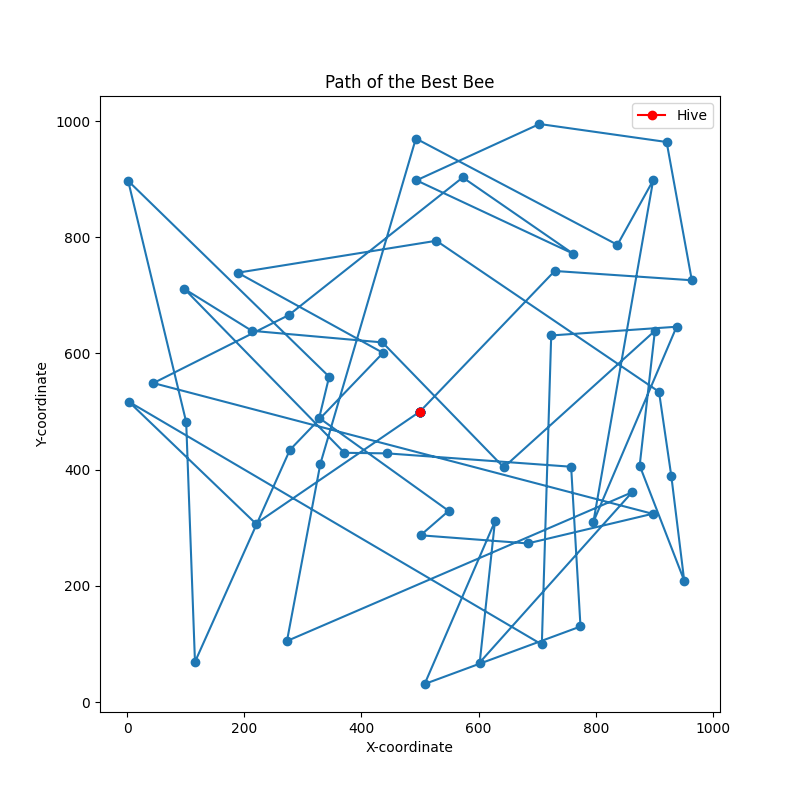

# Genetic Algorithm for Bee Path Optimization "Le Miel & Les Abeilles"

<b>Introduction</b>

This project implements a genetic algorithm to optimize the path of bees visiting flowers in a given field. 
The bees start from a hive, visit a set of flowers, and return to the hive.
The goal is to evolve generations of bees to find an optimal path that minimizes the total distance traveled.


<b>Project Structure</b>

The project consists of the following components:

    Bee Class: Represents an individual bee, storing information such as flower coordinates, fitness, hive coordinates, and unique identifier. Bees are initialized with random flower coordinates and can calculate their fitness based on the Euclidean distance between flowers.

    Hive Class: Represents a hive that manages the evolution of the bee population. It includes functions to generate bee objects, perform selection of top bees, implement crossover (classic or two-point), evolve the population, and apply mutation (swap or reverse). The Hive class also provides methods to visualize the evolution process and the best bee's path.

    Main Script: The main script initializes a Hive object, loads bee data from an Excel file containing flower coordinates, runs the genetic algorithm for a specified number of generations, and visualizes the results. The script includes functions to plot the average fitness per generation, the path of the best bee, and create a genealogy tree representing the ancestry of the best bee.

<b>Usage</b>

To run the genetic algorithm and visualize the results, execute the main script:
````
python main.py
````

<b>About</b>
<br>

*Distance Calculation:*

The distance between flowers is calculated using the Euclidean distance formula:
````
self.fitness += int(math.sqrt((x1 - x2) ** 2 + (y1 - y2) ** 2))
````

*Crossovers:*

1) Classic Crossover:
Description: In the evolve_population method, the "classic" crossover is performed.
Implementation: It involves dividing the flower lists of two parent bees into two halves and combining them to create two new child bees.
Code:
````
child1_flower_list = parent1.flowers[:math.floor(len(parent1.flowers) / 2)] + [x for x in parent2.flowers if x not in parent1.flowers[:math.floor(len(parent1.flowers) / 2)]]
child2_flower_list = parent2.flowers[:math.floor(len(parent2.flowers) / 2)] + [x for x in parent1.flowers if x not in parent2.flowers[:math.floor(len(parent2.flowers) / 2)]]
````

2) Two-Point Crossover:

Description: In the evolve_population method using the two_point_crossover method, a two-point crossover is performed.
Implementation: It involves selecting two crossover points and swapping the flower lists between these points to create two child bees.
Code:
````
crossover_points = sorted(random.sample(range(1, len(parent1.flowers)), 2))
start, end = crossover_points
````

*Mutations (Swap and Reverse):*

1) Swap Mutation:

Description: In the swap_mutation method, a randomly selected bee in the population undergoes swap mutation.
Implementation: Two random positions in the flower list of the selected bee are chosen, and the flowers at these positions are swapped.
Code:

````
i, j = random.sample(range(len(bee.flowers)), 2)
bee.flowers[i], bee.flowers[j] = bee.flowers[j], bee.flowers[i]
````
2) Reverse Mutation:

Description: In the reverse_mutation method, a randomly selected bee in the population undergoes reverse mutation.
Implementation: Two random positions in the flower list of the selected bee are chosen, and the flowers between these positions are reversed.
Code:
````
i, j = sorted(random.sample(range(len(bee.flowers)), 2))
bee.flowers[i:j+1] = reversed(bee.flowers[i:j+1])
````
Add Mutation:

Description: In the add_mutation method, either swap or reverse mutation is applied randomly to the entire population.
Implementation: It randomly selects between "swap" and "reverse" mutation types and applies the chosen mutation to a randomly selected bee.
Code:
````
mutation_type = random.choice(['swap', 'reverse'])
if mutation_type == 'swap':
    self.swap_mutation()
elif mutation_type == 'reverse':
    self.reverse_mutation()
````

*Important Numbers:*
The population size is set to 100 in the getBees method
The top 50 bees are selected as the "super bees" based on their fitness in the getSuperBees method
The number of generations is set by the num_generations variable in the main function: 50
Crossover is set to be performed every generation using "classic" crossover. 
A random mutation is added every 10 generations (random mutation swap or reverse).
The best bee in each generation is tracked, and the overall best bee is stored in the best_bee attribute of the Hive object.


<b>Plotting and Output:</b>
1) Average Fitness Plot:
The average fitness per generation is plotted using avg_fit_per_gen method.
2) Best Bee's Path Plot:
The path of the best bee in the final generation is plotted using plot_best_bee_path method.
3) Genealogy Tree:
A genealogy tree is created using create_genealogy_tree method, representing the ancestry of the best bee for a maximum of 5 generations.


<b>Analysis:</b>
At first the following configuration was used <b>and repeated</b> (multiple runs):
- Two-point crossover method
- Random mutations (swap and reverse) every 10 generations
  (To mimic real life conditions we keep mutations random)

Result:
- Average Fitness per Generation Plot


- Best Bee's path


- Genealogy Tree Of The Best Bee (pink node with the id 2332)


<span style="color:green"><b>Then,</b></span> this configuration was used <b>and repeated</b> (multiple runs):

- Classic crossover (two-halves combination method)
- Random mutations (swap and reverse) every 10 generations
(Note: To mimic real life conditions we keep mutations random)

Result:
- Average Fitness per Generation Plot


- Best Bee's path


- Genealogy Tree Of The Best Bee (pink node with the id 2179)


## Conclusion:

To demonstrate that the bees have learned and improved over generations, one can analyze the behavior of the average fitness over time.
After running multiple experiments we saw that the observed trends are consistent across different runs:
A plateau in the fitness values suggests that the population is converging or stabilizing, indicating that the bees are consistently achieving a certain level of performance.
This is the case of the second plot (classic crossover) where we can see the drop after 15 generations and a plateau compared to the first plot where we have
a x=y look-like curve that might indicate that the two-point crossover is leading to diverse solutions, but the population is not converging to a stable state.
The stability after 15 generations with classic crossover may imply that this crossover strategy is effective in converging the population to a consistent solution.
=> The classic crossover strategy has facilitated the convergence of the population to a locally optimal solution.

However, fine-tuning and experimenting with a combination of other strategies might help leading to improved performance making the plateau lower
making the bees reach less fitness score. This way we can see a better path pattern of the best bee taking the shorter path


# Author 
Aimen CHERIF
